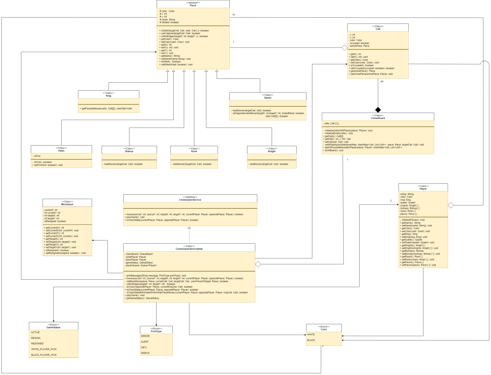
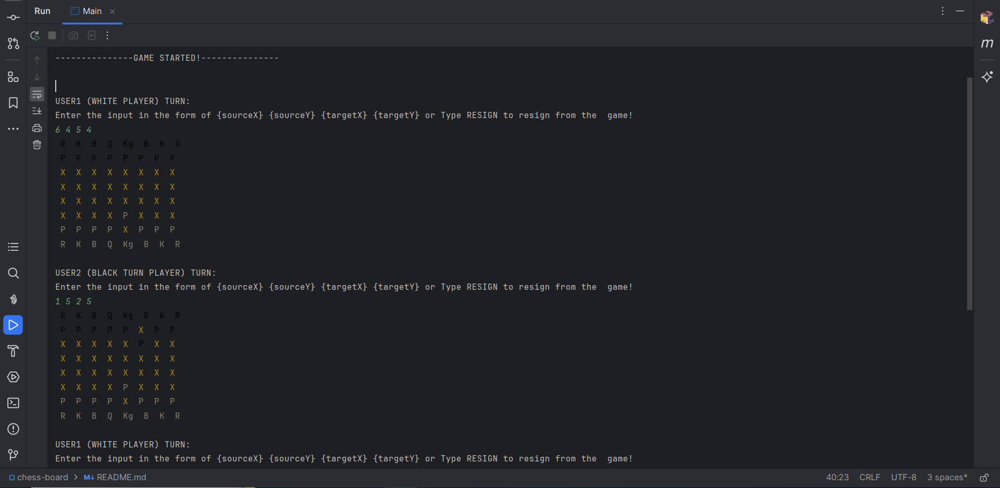
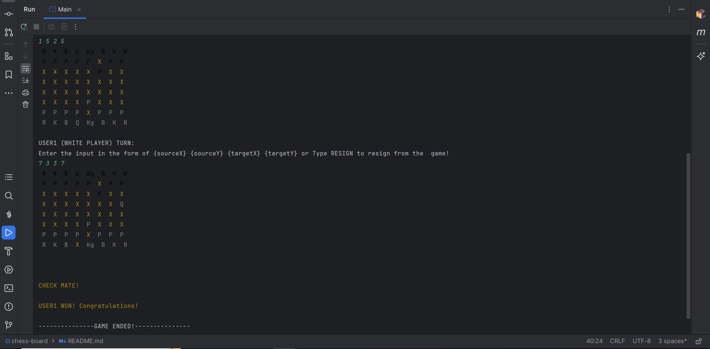

# Chess-game

This Java application presents a basic implementation of a chess game. It includes essential classes and functionalities for managing the game board, pieces, players, and game logic. Players interact with the game to play matches, execute moves, and determine outcome like checkmate.

## Technologies Used:
- 	Java

## Prerequisites

- Java Development Kit (JDK) 17
- IntelliJ IDEA / Eclipse


## Low-Level Diagram:



## Steps to run the application
1. Clone or download the Spring Boot project from the repository (if not already available).    
   ```bash
   https://github.com/srinivasa8/chess-game.git
2.	Open the project using an IDE like IntelliJ IDEA, Eclipse, or Spring Tool Suite.
3. Using the terminal or within your IDE, execute mvn clean install to build the project and ensure the build completes successfully without any errors.
4. Locate the Main class file and Run it to start the application.
5. Once the application starts, you will see an interactive console which prompt you to input the source & target location to the move the piece of your choice.
   This application is designed based on assuming the chess board as 2D matrix, so please provide input position according to the matrix indices.
   For more please refer the below diagram and screenshots
   ```bash
   2D Matrix with indices which represent the 8x8 chess board:
   
                 00 01 02 03 04 05 06 07
                 10 11 12 13 14 15 16 17
                 20 21 22 23 24 25 26 27
                 30 31 32 33 34 35 36 37
                 40 41 42 43 44 45 46 47
                 50 51 52 53 54 55 56 57
                 60 61 62 63 64 65 66 67
                 70 71 72 73 74 75 76 77
   ```
   Console screenshots:  
   <br>
   
   <br>
   